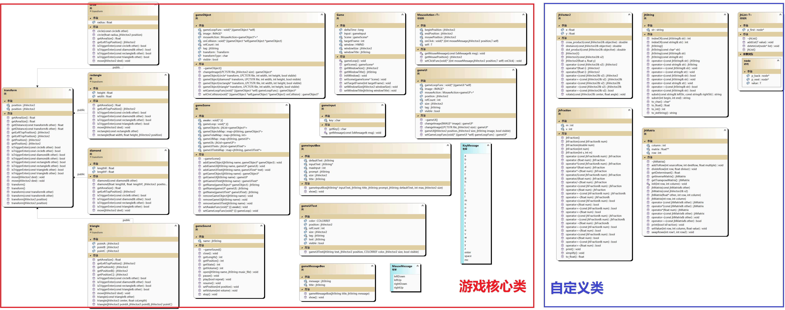

# ✅JHMG 游戏引擎

JHMG 游戏引擎是我自己写的一个简单的2D游戏引擎，旨在帮助快速搭建和开发2D游戏。

## 特点

- 提供了游戏对象管理、界面显示、音效播放、用户输入处理等核心功能。
- 包含了一系列基础的自定义类，如字符串处理、数学计算和图形操作等。
- 易于使用和扩展，适合开发小型的2D游戏或图形应用程序。

### 依赖

- [EasyX](https://easyx.cn/)：图形库，用于图形界面的绘制和处理。

### 下载

你可以从GitHub仓库下载源代码：

```bash
git clone https://github.com/your_username/JHMG-engine.git
```
### 类图



### 示例代码

```cpp
#include "JHMG engine.h"

//声明全局游戏对象
Game* mainGame;

//声明函数
void loop();
void trigle(gameObject* other);

int main(int argc, char* argv[])
{
	//创建游戏对象
	mainGame = new Game;
	//设置窗口大小和标题
	mainGame->setWindowSize(jhVector2(800,600));
	mainGame->setWindowTitle("Game");
	//设置游戏帧率
	mainGame->setTargetFrame(60);
	//设置游戏循环函数(每帧调用一次)
	mainGame->setGameLoopFunc(loop);

	//创建UI对象
	gameUI* xiaoxin = new gameUI(jhVector2(0,0),jhVector2(50,50),".\\xiaoxin.png",true);
	//添加UI对象到游戏中
	mainGame->addGameUI("xiaoxin",xiaoxin);
	//创建文本UI
	gameUIText* text = new gameUIText(jhString("fps"), jhVector2(100, 100), true);
	//添加文本UI到游戏中
	mainGame->addGameUIText("text", text);
	//创建游戏对象
	gameObject* player = new gameObject(new jhObject2D::circle(25,jhVector2(170,70)),".\\pkq.png",50,50,true);
	gameObject* pikaqiu = new gameObject(new jhObject2D::circle(25, jhVector2(270, 70)), ".\\pkq.png", 50, 50, true);
	//绑定游戏对象碰撞事件
	player->setOnCollision(trigle);
	//添加游戏对象到游戏中
	mainGame->addGameObject("player",player);
	mainGame->addGameObject("pikaqiu", pikaqiu);

	//初始化窗口开始游戏
	mainGame->initWindow();
}

void loop()
{
	//获取游戏对象
	auto player = mainGame->getGameObject("player");
	//获取UI文本对象
	auto text = mainGame->getGameUIText("text");
	//拼接显示fps
	text->text = "fps:"+to_string(int(1000 / mainGame->deltaTime));
	//获取键盘输入
	auto key = mainGame->Input.getKey();
	//判断键盘输入
	if (key == KeyMessage::a)
	{
		jhVector2 currentPosition = player->transform.circle->getPosition();
		//x = deltaX + X0 = V*t + X0
		currentPosition += jhVector2(-150,0)* ((float)mainGame->deltaTime / 1000);
		player->transform.circle->move(currentPosition);
	}
	if (key == KeyMessage::d)
	{
		jhVector2 currentPosition = player->transform.circle->getPosition();
		currentPosition += jhVector2(150,0)* ((float)mainGame->deltaTime / 1000);
		player->transform.circle->move(currentPosition);
	}
	if (key == KeyMessage::w)
	{
		jhVector2 currentPosition = player->transform.circle->getPosition();
		currentPosition += jhVector2(0,-150)* ((float)mainGame->deltaTime / 1000);
		player->transform.circle->move(currentPosition);
	}
	if (key == KeyMessage::s)
	{
		jhVector2 currentPosition = player->transform.circle->getPosition();
		currentPosition += jhVector2(0,150)*((float)mainGame->deltaTime/1000);
		player->transform.circle->move(currentPosition);
	}
	if (key == KeyMessage::space)
	{
		//删除物体
		cout << "delete pikaqiu" << endl;
		mainGame->removeGameObject("pikaqiu");
	}
	if (key == KeyMessage::esc)
	{
		//退出游戏
		exit(0);
	}
}

void trigle(gameObject* other)
{
	//碰撞输出名字
	cout<<mainGame->getName(other)<<endl;
}
```